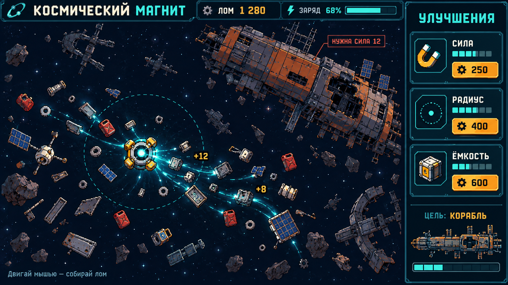

# Космический магнит / Cosmic Magnet

Небольшая одиночная 2D-игра для Windows/Steam: магнит собирает космический лом, игрок покупает улучшения и постепенно добирается до огромного заброшенного корабля. Название рабочее, занятость не проверена.

**Состояние на 10 октября 2026:** CM-001–003 приняты; подготовка CM-004 принята, человеческий плейтест отложен. Визуальный срез и полиш исправлены. По прямому поручению Эльдара реализованы CM-H01 и цикл ITERATE CM-H02: импульс, расчистка, модуль, освобождение и буксировка корабля. Актуальное задание: `docs/CM-H01-GAMEPLAY-HOOK.md` и STATUS. Остальной звук/полная прогрессия отложены; спрос игроков не доказан.

## Читать в этом порядке

1. [Правила для исполнителя](AGENTS.md).
2. [Требования и правила игры](docs/GAME-SPEC.md).
3. [Этапы и критерии приёмки](docs/DEVELOPMENT-PLAN.md).
4. [Текущая задача и состояния](docs/STATUS.md).
5. [Первое задание для GLM](docs/GLM-START.md).
6. [Формат сдачи и проверки](docs/REVIEW.md).

**Стек:** Godot 4.5.1 Standard, GDScript, Compatibility renderer, Windows x64. Версия фиксируется для воспроизводимости. Это отдельный Godot-проект внутри репозитория; существующий проект и документы Unity не являются инструкциями для этой игры. Unity для этой игры не требуется.

## Визуальный ориентир



Это концепт, не работающая игра и не готовый набор спрайтов. Он задаёт композицию, палитру и настроение. Рабочие ассеты создаются отдельно; цельный скриншот нельзя использовать как игровой фон с нарисованным интерфейсом. Детализация финальной графики уточняется после рабочего прототипа.

## Временная графика Void (CM-V01)

По поручению Эльдара демо использует CC0-наборы Foozle Void и собственные пиксельные силуэты магнита/лома. Это временный вариант, не новый финальный ориентир. Детализированная металлическая графика концепта остаётся целью. Анимации листов идут по времени симуляции и останавливаются в паузе/меню. Происхождение: `assets/ASSET-LICENSES.md`; границы: `docs/CM-V01-VOID.md` и `docs/CM-V02-READABILITY.md`. Реле/крепления пронумерованы попарно, после освобождения корабля стрелки показывают направление к маяку; фактическое спасение получает короткую визуальную отдачу перед итоговой карточкой.

## Рабочий процесс

GLM реализует маленькую задачу → открывает PR с доказательствами → Codex проверяет изменения и доступные проверки → замечания исправляются → Codex публикует решение и следующую задачу. Игровые впечатления и тесты Windows дополняются Эльдаром, когда их нельзя проверить в среде Codex.

Codex не подключён непосредственно к локальному процессу GLM. Команды передаются через документы/PR и сообщения пользователя. Автоматического фонового наблюдения за репозиторием пока нет.

Открывать проект в редакторе и запускать команды из плана можно после появления `project.godot` в CM-001. Обновления этой игры ограничены `games/cosmic-magnet/**` и отдельным workflow; остальные игры steam-dev независимы.

## Запуск и проверки (CM-003)

Движок: Godot 4.5.1 Standard (Windows x64 — `Godot_v4.5.1-stable_win64.exe`, для вывода в консоль — вариант `_console.exe`; в CI — Linux-бинарь той же версии, SHA512 из официального `SHA512-SUMS.txt` релиза).

Из корня репозитория:

```sh
# импорт ассетов (создаёт .godot/, не коммитится)
godot --headless --path games/cosmic-magnet --editor --import
# smoke: 120 кадров основной сцены без ошибок
godot --headless --path games/cosmic-magnet --quit-after 120
# тесты правил сбора и сброса визуального состояния (46 проверок)
godot --headless --path games/cosmic-magnet --script tests/test_core.gd
# тесты экономики (61 проверка, включая benchmark темпа первой покупки)
godot --headless --path games/cosmic-magnet --script tests/test_economy.gd
# тесты сохранения (60 проверок; временный профиль, не сохранение игрока)
godot --headless --path games/cosmic-magnet --script tests/test_save.gd
# играть: меню → NEW GAME/CONTINUE, LAUNCH в доке, Esc — пауза
godot --path games/cosmic-magnet
```

Сохранение (CM-R10–R12): `user://cosmic_magnet/save_v1.json` (+ `.bak`), версия/валидация/атомарная запись через tmp; автосохранение при покупке, разгрузке, уникальной находке и штатном выходе; закрытие посреди вылета не начисляет груз; загрузка возвращает в DOCK. Полный сброс прогресса — удалить папку `user://cosmic_magnet`.

Баланс (предметы, заряд, ёмкость, цены улучшений, реликвия, корабль) — единый источник `data/balance.json`; правила расчёта цен живут в `scripts/economy.gd` и нигде не дублируются.

CI: `.github/workflows/cosmic-magnet.yml` — импорт, smoke, три набора тестов на `ubuntu-latest`, фильтр путей `games/cosmic-magnet/**` и сам workflow; провал по `SCRIPT ERROR|ERROR:` даже при нулевом коде выхода. Job `gameplay-video` пишет ~3,5 минуты геймплея с настоящими кликами (NEW GAME → LAUNCH/магазин) в артефакт `cosmic-magnet-gameplay-mp4`. Job `windows-build` собирает Windows x64 билд (артефакт `cosmic-magnet-windows-x64`) со smoke-запуском без редактора.

## Плейтест (CM-004)

Билд для раздачи — CI-артефакт `cosmic-magnet-windows-x64` (Actions → последний run ветки). Процедура сессий, сводная таблица и критерий решения — `docs/playtest/README.md`; анкета участника — `docs/playtest/anketa.md`.

### Эксперимент CM-H01

Расчистите отмеченные золотыми дугами обломки и заберите открывшийся модуль. В доке установите магнитный импульс (15 лома) и силу 2 (20 лома). В вылете удерживайте ЛКМ 0,25–0,8 с и отпускайте для группового притяжения; модуль добавляет два ограниченных перехода цепи. Для малого корабля разорвите три крепления цепью: направьте магнит к голубому реле, удержите ЛКМ и отпустите. Затем оставьте 20 единиц свободного трюма, примените импульс рядом с кораблём и двигайте магнит к EXIT BEACON. Повторяйте импульсы для буксировки; корабль остаётся на месте между импульсами, положение сохраняется при возврате и выходе. Эвакуация даёт 100 лома и завершает первый фрагмент. Прогресс участка и финал сохраняются.

Дополнительные регрессионные проверки: `godot --headless --path . --script tests/test_hook.gd`. Это эксперимент перед живым плейтестом, а не подтверждение wishlist-потенциала.
