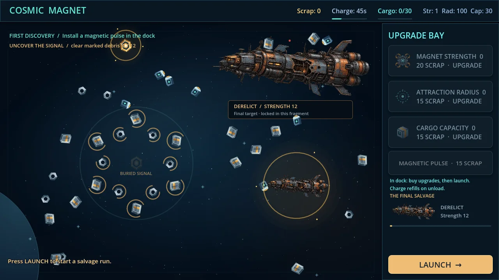
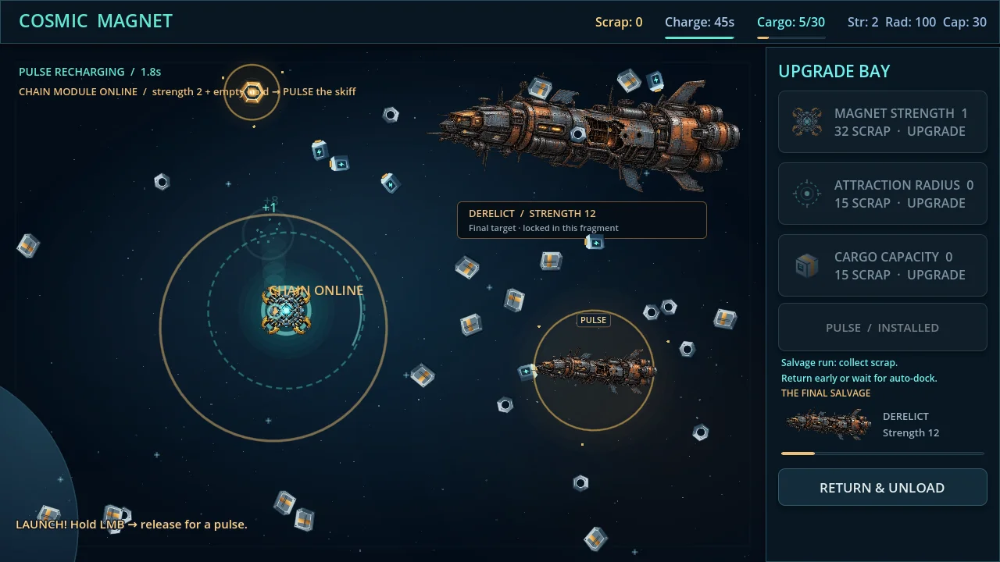
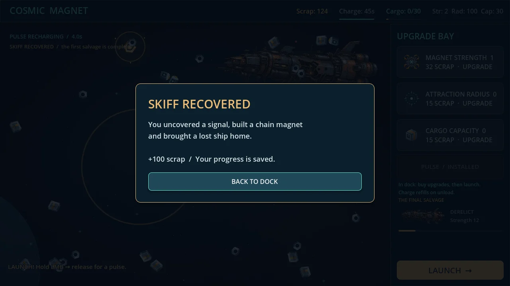

# CM-H01 — реализация и техническая проверка Codex

Дата: 2026-10-11. Код: `757f8dc2e43c40536363790bee6135518061cc42`, база `5639575d1ddc4dbe099a5f72dc0993208aac74e0` (visual-polish). Исполнитель Codex, по прямому поручению «Сделай сам» и «Продолжай». READY_FOR_REVIEW; это не независимая приёмка собственной реализации.

## Что можно сыграть

Нулевой профиль → сбор лома → покупка импульса → расчистка 12 отмеченных обломков → реальный модуль → ограниченная цепь → сила 2 и 20 свободного трюма → активный импульс рядом с малым кораблём → награда 100 и финальная панель в DOCK. Обычный derelict силы 12 остаётся обещанием следующего этапа. Новые ассеты не добавлялись: использованы уже принятые оригинальные текстуры/SVG проекта.

Импульс удерживается 0,25–0,8 с, имеет снимок до 12 целей и cooldown 4 с. Модуль расширяет снимок максимум на 8 целей в 2 перехода по 75 px. Нет обхода силы/трюма или повторного начисления. Модуль, обломки и эвакуация сохраняются; старые v1 сохраняют свои три прокачки и получают заблокированный импульс.

## Фактические проверки

Godot 4.5.1 Standard, Linux Compatibility / Mesa llvmpipe:

- `godot --headless --path games/cosmic-magnet --editor --import`: PASS, нет SCRIPT ERROR/ERROR.
- `godot --headless --path games/cosmic-magnet --quit-after 120`: PASS.
- `--script tests/test_core.gd`: 46/46.
- `--script tests/test_economy.gd`: 65/65.
- `--script tests/test_save.gd`: 60/60. Ожидаемые ошибки разбора специально испорченного JSON исключены, прочих ошибок нет.
- `--script tests/test_hook.gd`: 47/47; итог **218/218**. Новые проверки подключены к CI, лог прикладывается при ошибке.
- Полный запуск с отрисовкой 1280×720: `ticks=527 shots=2 covers=12 module=true skiff=true scrap=124`, нет SCRIPT ERROR/ERROR; 773 записанных кадра (12,883 с с финальной выдержкой).
- Полный запуск 1600×900: `ticks=753 shots=3 covers=12 module=true skiff=true scrap=109`, нет SCRIPT ERROR/ERROR. Визуально проверены начальный экран, модуль и финал, текст/кнопки без перекрытий.

`tools/hook_playthrough.gd` — воспроизводимый QA-драйвер. Он создаёт отдельный нулевой тестовый профиль через new_game, затем перемещает реальную мышь и подаёт события кнопки; не выдаёт лом, прокачки, модуль или корабль и не вызывает register_collection. Он читает позиции/доступность предметов для выбора цели, поэтому скорость прохождения **не равна** скорости нового игрока. `--fixed-fps 60`, optional `CM_EVIDENCE_DIR`, `--write-movie /tmp/hook.avi`. При разрешениях окна координаты масштабируются.

Найдены и исправлены во время проверки: извлечение корабля без применения купленного импульса; обращение эффекта к уже удалённым целям. Оба случая покрыты регрессиями. Старые тесты уникальной реликвии уточнены по discovery==empty: новые модуль/корабль не являются старой реликвией.

## Запись

[15 секунд настоящего игрового рендера](../evidence/CM-H01/hook-15s.mp4). Запись сделана в 1280×720, версия в репозитории уменьшена до 960×540; звук не добавлен. Последние 2,117 с — выдержка последнего реального кадра, чтобы получить ровно 15 с. Это техническая запись, не опубликованный рекламный ролик и не свидетельство человеческого интереса.

## Решение и следующий этап

**ITERATE**, для продуктовой готовности демки. Крючок теперь имеет видимый конечный результат и смену возможности, но оптимизированный маршрут занимает считанные секунды: заявленной 10–15-минутной демки ещё нет. Удлинять её числом одинаковых обломков не следует.

Следующий один цикл: разделить эвакуацию на 2–3 осмысленные задачи (расчистить путь, освоить цепь, вытянуть корабль из зоны), сделать применение цепи обязательным и читаемым, проверить первую минуту без объяснений на 5–10 людях по обновлённой анкете. Финальная эвакуация сейчас — реальный движущийся объект и однократный захват, но ещё не многосоставная задача. Малый корабль использует уменьшенную текстуру derelict; для рекламной демки потребуется отдельный силуэт.

Живые плейтесты/анкеты: **NOT_RUN**, людей не приглашали. Публичный показ ролика: **NOT_RUN**. Wishlist-конверсия: **NOT_MEASURED**. CONTINUE и официальное открытие остального CM-005 этим отчётом не заявляются. Windows-проверка выполняется отдельно в CI нового PR; Linux не заменяет запуск Windows.
