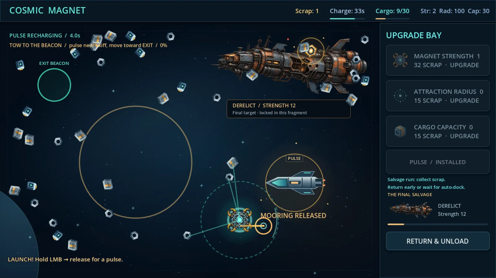
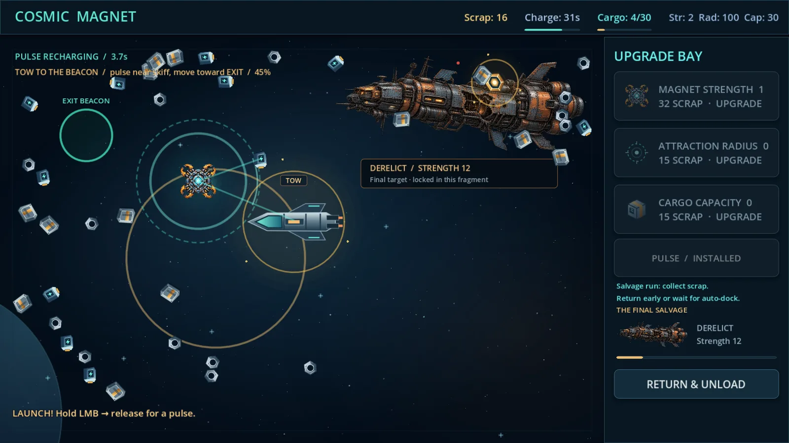
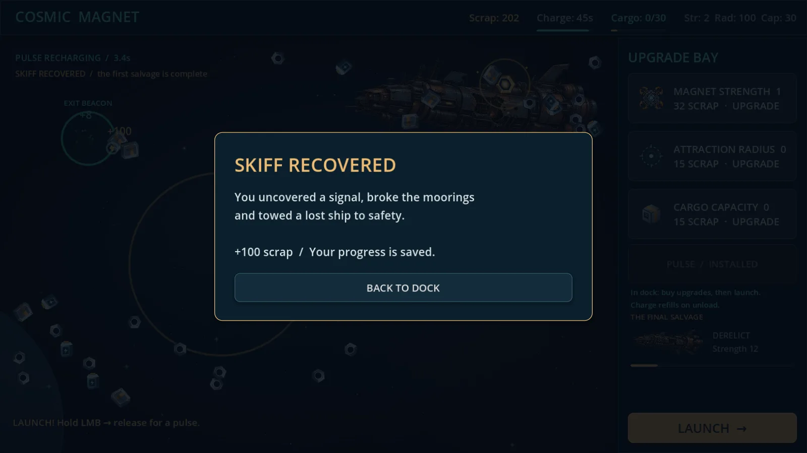

# CM-H02 — сдача одного цикла ITERATE

Дата: 2026-10-11. Исполнитель: Codex по прямому поручению «Продолжай». База/target: `feat/cosmic-magnet/CM-H01-gameplay-hook`, `0deea37f1ff37f2639ac0ca61d53a44219c6999a`. Код проверен на `4e27117f7e350c6300db9861bd086429845458da`. READY_FOR_REVIEW: независимая приёмка и человеческие анкеты не подменяются собственной проверкой.

## Изменение поведения

H01 позволял просто подлететь к кораблю и применить один импульс. Теперь после модуля открываются три пары «реле → крепление». Прямой сбор и прямой импульс не снимают крепление: нужен настоящий переход цепи от соответствующего реле. Один разряд снимает одно крепление, ближайшее к позиции игрока; связь вспыхивает, крепление исчезает, HUD обновляет счётчик.

После освобождения трёх связей корабль нужно буксировать к EXIT BEACON. Для движения нужны активный импульс, сила 2 и 20 свободного трюма. Скорость ограничена 160 px/s; между импульсами корабль стоит. Контакт с магнитом вне маяка не выдаёт награду. Доставка в радиус 42 px даёт 100 лома ровно один раз, разгружает текущий груз и заканчивает фрагмент.

Позиция сохраняется в конце импульса, при возврате и штатном выходе; снятые крепления записываются сразу. Старые v1/H01 совместимы, завершённый H01 не открывается заново. Новый корабль — собственный SVG с отдельным силуэтом, происхождение записано в ASSET-LICENSES. Это небольшой функциональный визуальный срез, не полный арт-пасс.

## Проверки

Движок: Godot 4.5.1 Standard / Compatibility. ОС: Linux, Xvfb + Mesa llvmpipe. Во всех командах движок — `/tmp/cosmic-hook-runtime/Godot_v4.5.1-stable_linux.x86_64`, cwd — корень checkout.

| Проверка / аргументы движка | Результат | Доказательство |
|---|---|---|
| `--headless --path games/cosmic-magnet --editor --import` | PASS | нет SCRIPT ERROR/ERROR |
| `--headless --path games/cosmic-magnet --quit-after 120` | PASS | нормальное завершение, нет ошибок |
| `--headless --path games/cosmic-magnet --script tests/test_core.gd` | 46/46 PASS | обычный сбор/600s soak/лимит/пауза |
| аналогично `tests/test_economy.gd` | 65/65 PASS | покупки и экономика |
| аналогично `tests/test_save.gd` | 60/60 PASS | ожидаемые сообщения Parse JSON failed в тестах повреждения; других ошибок нет |
| аналогично `tests/test_hook.gd` | 64/64 PASS | реальные цепи, выбор реле, запреты прямого сбора, буксировка, пауза, координаты, миграция |
| `--audio-driver Dummy --path games/cosmic-magnet --resolution 1280x720 --position 0,0 --fixed-fps 60 --script tools/hook_playthrough.gd` | PASS | ticks=3093, shots=11, covers=12, module=true, released=3, skiff=true, scrap=217; нет SCRIPT ERROR/ERROR |
| тот же запуск, `--resolution 1600x900 --write-movie /tmp/cosmic-hook-runtime/tow-final.avi` | PASS | ticks=3111, shots=11, released=3, skiff=true, scrap=202; 3357 кадров/55,95 с; нет SCRIPT ERROR/ERROR |
| Windows export / запуск | CI нового PR | проверить по финальному SHA, Linux этим не подменяет Windows |

Итого **235/235** автоматических проверок. Существующий тест сбора уточнён: обычный collection soak выбирает обычные предметы/старую реликвию, не неподвижные реле/крепления/корабль. Их сценарии покрыты hook-тестом; прежние assertions и объём soak не уменьшены.

QA-драйвер читает позиции для выбора целей и управляет мышью/кнопками; профиль нулевой и отдельный. Деньги, модуль, крепления, корабль и награда не выдаются тестовым кодом. Полный оптимизированный маршрут занимает около 52 с симуляции до финала, но это не время первого прохождения человеком. Изменения после code SHA в отчёте — только документация/доказательства.

## Демонстрация

[15-секундный монтаж настоящего запуска](../evidence/CM-H02/rescue-15s.mp4): участки 8–13, 24–29, 49–54 с одного запуска в 1600×900. Обычная скорость, без дорисовки геймплея или звука; уменьшен до 960×540. Это техническая демонстрация, не публичная рекламная кампания.

## Решение и пределы

Один обещанный цикл **ITERATE выполнен**: цепь обязательна, эвакуация стала отдельной пространственной задачей. Дальше — живой плейтест этой зафиксированной версии, затем ревью реальных анкет. README процедуры и anketa обновлены под цепь, буксировку, остановку/раннее завершение; старые и новые ответы не смешиваются.

5–10 человеческих сессий: **NOT_RUN**. Анкеты: **ответов нет**, подготовлен только шаблон. Публичный показ: **NOT_RUN**. Steam wishlist: **NOT_MEASURED**. CONTINUE и остальной CM-005 не открыты. Этот фрагмент не превращён в 10–15-минутную демку; смысл следующего теста — проверить понятность и желание ещё одной спасательной задачи до производства контента.
