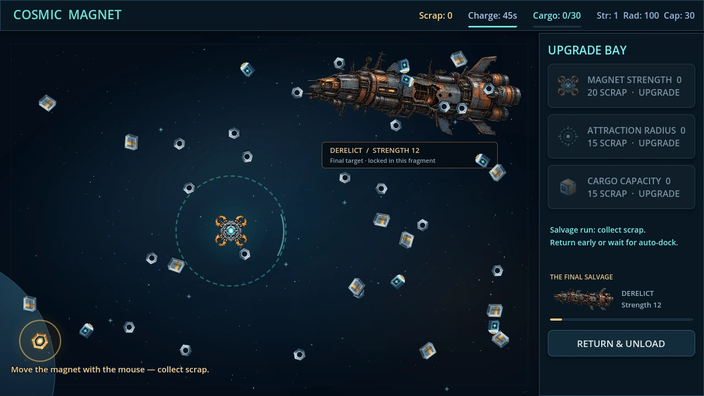
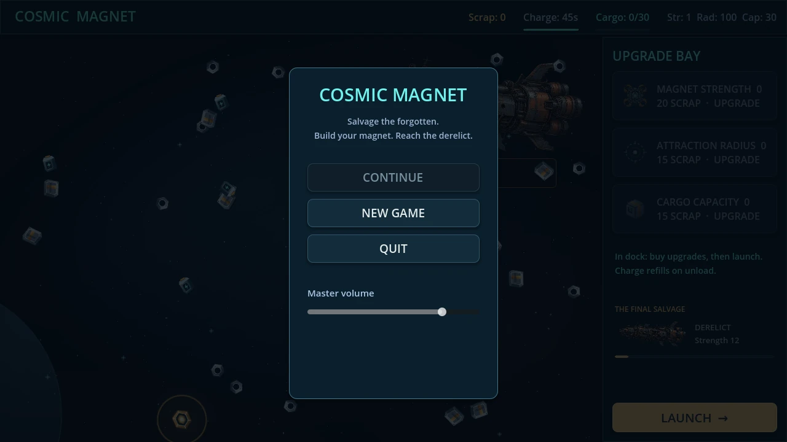

# Cosmic Magnet — visual refresh (CM-005 art slice)

Requested directly by Eldar on 2026-10-10: replace the placeholder graphics and push the result. This authorizes an isolated visual branch ahead of the outstanding CM-004 playtests; it does not claim a CONTINUE decision.

Code verified: `ec240e82324ec132562c61c3cde923773fde83d8` (before this documentation commit).

Base: accepted CM-003 plus CM-004 preparation at `a11bb5a766536a0f5abea399a398d581c1c4ad34`. Branch: `feat/cosmic-magnet/visual-refresh`.

## Result

- Separate transparent painted sprites for the derelict and magnetic drone; compact WebP sources (no background/UI baked into either sprite).
- Original beveled nut, plate, battery, relic and upgrade icons; stars, subtle nebula/planet backdrop.
- Styled upgrade cards, gold launch action, hover/focus/disabled states, live charge/cargo/goal meters and main menu. All existing node paths and the CI driver's new-game/strength/launch click positions remain valid.
- Exact attraction-radius markers, beams toward eligible items, bounded collection sparks and resource popups. The effect reads successful collection; it does not grant rewards.
- Collection/economy/save rules, prices, balance.json and limits unchanged. Larger sprite drawings do not change capture radius or item mass.
- Provenance and AI generation prompts in `assets/ASSET-LICENSES.md`.

## Validation performed locally

Engine: official Godot 4.5.1 Standard; Linux, Compatibility, Xvfb/Mesa llvmpipe. Audio driver Dummy for visual capture.

Commands from the repository root (engine executable replaced here by `godot`):

```sh
godot --headless --path games/cosmic-magnet --editor --import
godot --headless --path games/cosmic-magnet --quit-after 120
godot --headless --path games/cosmic-magnet --script tests/test_core.gd
godot --headless --path games/cosmic-magnet --script tests/test_economy.gd
godot --headless --path games/cosmic-magnet --script tests/test_save.gd
```

Import and smoke PASS, no script errors. Existing suites PASS: **37 + 61 + 60 = 158**. The save suite intentionally emits `Parse JSON failed` when testing damaged files; no other script errors. Economy benchmark: 13.53s from first launch, scripted route.

Actual rendered main-menu / new-game / launch / return screens captured from the game with a disposable SaveService profile (removed afterward). No screenshot is a generated mockup. 1280×720 inspected; 1920×1080 inspected as well: no clipped HUD/buttons. The renderer reports only its expected unsupported V-Sync warning when using software rendering.




## Limits / next step

This is the visual slice of CM-005 for user review. A soundtrack, sound effects, configurable effect reduction and full CM-005 acceptance are still outstanding. Windows export/runtime is delegated to this PR's CI and is not claimed as a local Windows test. No performance budget or 150-item target measurement is claimed. CM-004 live observations and CONTINUE/ITERATE/STOP remain outstanding.
